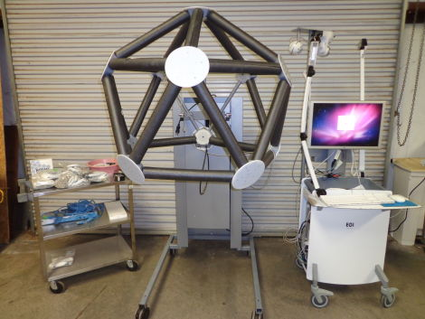

# Resumo do artigo de RP

[https://github.com/bneurd/RP36O/blob/master/MAMEM_SSVEP/DataAcquisitionDetailsExperiment2.pdf](https://github.com/bneurd/RP36O/blob/master/MAMEM_SSVEP/DataAcquisitionDetailsExperiment2.pdf)

## Aquisição de dados - Descrição detalhada

### Demografia dos testados

Onze participantes, trabalhadores do Centro de pesquisas e tecnologias Hellas (CERTH), sendo 8 homens e 3 mulheres, entre 25 e 39 anos.
Foram categorizados em tamanho ou espessura do cabelo.

### Equipamento adquirido

O sistema consiste em uma tela de 60hz, para apresentação dos quadros, e com a opção de VSync ativada, garatindo que todos os frames serão vistos.
Para a coleta de alta precisão do EEG, utilizou EGI 300 Geodesic EEG System (GES 300), e o HydroCel Geodesic Sensor Net (HCGSN) com 256 canais e sampling rate de 250Hz.

O experimento consiste em apresentar uma tela com 5 caixas violetas para o usuário, no qual cada uma piscará em uma frequência (6.66, 7.50, 8.57, 10.00 e 12.00 Hz). À cada 5 segundos será realizada uma tentativa (trial), e o intervalo é representado por todas as caixas não piscando.
A caixa que o testado deve observar é marcada com uma seta amarela.

O processo do experimento é dado da seguinte forma:

- O testado terá um período de adaptação de 5 apresentações teste.
- São definidas 5 sessões para cada testado.
- Cada sessão terá 25 tentativas (trials).
- Entre cada sessão, terá um intervalo de 5 min.
